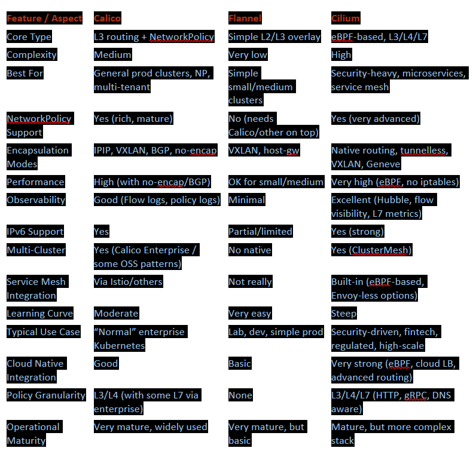

A CNI plugin is required because Kubernetes cannot create pod networking by itself. The control‑plane and kubelet know how to run containers, but they do not know how to give pods IPs or route traffic between nodes. A CNI plugin provides that missing network layer.
Pod - to - pod N/W 

A CNI like Calico is installed once on the control‑plane, and Kubernetes automatically deploys a Calico agent to every node through a DaemonSet, so you never install it manually on workers. This single install enables pod IP assignment, routing, and pod‑to‑pod communication across the whole cluster. After applying the Calico manifest on the master, each worker that joins will automatically get its own Calico pod.

---  

---

#### **Calico — “Default safe choice for most production clusters”**
- **Best when:**
  - You want **NetworkPolicy** (multi‑tenant, security zones, namespaces isolation).
  - You run **enterprise apps** (banks, hospitals, SaaS) with mixed workloads.
  - You want **good performance** without going full eBPF brain‑surgery.
- **Strengths:**
  - Mature, widely used, tons of docs.
  - Multiple dataplanes: iptables, eBPF, Windows support, etc.
  - Can run in **no‑encap mode with BGP** → very fast in on‑prem DCs.
  - Good balance between **features vs complexity**.
- **Weaknesses:**
  - More complex than Flannel.
  - BGP setups can be tricky if you don’t know routing.
  - eBPF mode is powerful but adds complexity.

**Use Calico when you don’t want to overthink it but still want real production networking.**

---

#### **Flannel — “Simple, works, but limited”**
- **Best when:**
  - You’re doing **labs, POCs, home‑lab, training**, or **very simple prod**.
  - You don’t need NetworkPolicy.
  - You want **minimum moving parts**.
- **Strengths:**
  - Very easy to deploy.
  - Very few knobs → less to break.
  - Good for **single‑tenant**, internal clusters.
- **Weaknesses:**
  - **No NetworkPolicy** (unless you add another component).
  - Limited observability, no advanced security.
  - Not ideal for multi‑tenant or regulated environments.

**Use Flannel when you just want pods to talk and don’t care about advanced security.**

---

#### **Cilium — “For people who want to see packets’ souls”**
- **Best when:**
  - You care about **deep security**, **L7 policies**, **zero‑trust**, **microservices**.
  - You want **eBPF performance** and **no iptables bottlenecks**.
  - You’re in **fintech, security‑sensitive, high‑scale microservices**.
- **Strengths:**
  - eBPF dataplane → **very fast**, low overhead.
  - L3/L4/L7 policies (HTTP, gRPC, DNS aware).
  - Built‑in observability via **Hubble**.
  - Native **service mesh** features without sidecars.
- **Weaknesses:**
  - Complex to understand and operate.
  - Debugging requires eBPF knowledge.
  - Overkill for simple clusters.

**Use Cilium when security, observability, and performance are first‑class requirements.**

---

### 🔹 Pros & cons table (short, sharp)

| CNI     | Pros                                                                 | Cons                                                                 |
|---------|----------------------------------------------------------------------|----------------------------------------------------------------------|
| Calico  | NetworkPolicy, BGP, good perf, mature, flexible                      | More complex than Flannel, BGP/eBPF can be tricky                    |
| Flannel | Very simple, easy to deploy, good for labs/dev                       | No NetworkPolicy, limited features, not ideal for multi‑tenant prod  |
| Cilium  | eBPF, L7 policies, Hubble, service mesh, high perf, deep security    | Complex, steeper learning curve, overkill for basic setups           |
---
