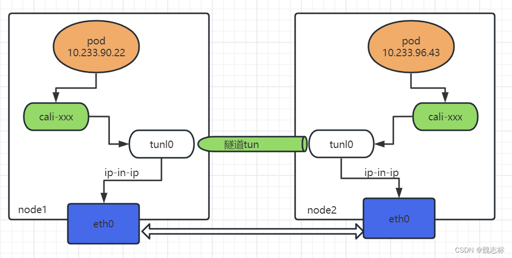
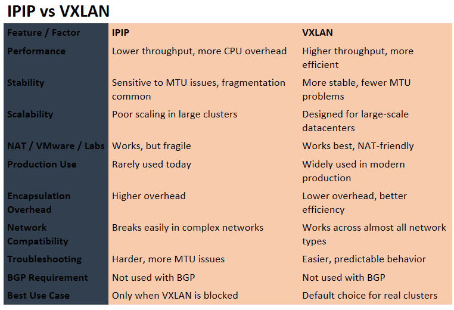

CALICO Aercthure::

## **Paragraph**  
Calico is a pure Layer‑3 networking system that builds a real routed network inside Kubernetes. Instead of overlaying packets blindly like Flannel, Calico programs actual routes into each node using BGP, so every node knows exactly where every pod network lives. It can use IPIP or VXLAN tunnels when direct routing isn’t possible, but BGP is always the control‑plane brain. Calico also enforces network policies using Linux kernel primitives (iptables or eBPF), giving it high performance and low overhead. In production, Calico is chosen because it scales, integrates with real datacenter routing, supports multi‑cluster, and provides strong security controls.

---

# **Calico Architecture — Notes**

### **1. Calico is L3 Routing (not L2 overlay)**
- Every node gets a **Pod CIDR**.  
- Calico distributes these CIDRs using **BGP**.  
- Nodes route packets directly → no unnecessary encapsulation.



### **2. BGP = Calico’s control plane**
- Nodes exchange routing info.  
- Each node knows where every pod lives.  
- Works with:  
  - Node‑to‑node  
  - Node‑to‑router  
  - Router‑reflectors  
  - Datacenter fabric  

### **3. IPIP / VXLAN = optional tunnels**
- Used only when direct routing is not possible.  
- IPIP = lighter, faster.  
- VXLAN = more compatible with cloud networks.  
- Your setup = **BGP + IPIP**.

### **4. Calico CNI = pod networking**
- Creates veth pairs.  
- Assigns pod IPs.  
- Programs routes.  
- Configures iptables/eBPF rules.

### **5. Calico Felix = the brain on each node**
- Programs routes.  
- Applies network policies.  
- Manages IP sets.  
- Talks to kube-apiserver.

### **6. Calico Typha (optional)**
- Used in large clusters.  
- Reduces API server load.  
- Aggregates updates → distributes to nodes.

### **7. Calico Datastore**
- Default = Kubernetes API.  
- Enterprise = etcd or KDD.  
- Stores:  
  - IPAM  (IP Address Management)  
  - Policies  
  - BGP config  
  - Node info  

### **8. Calico IPAM**
- Allocates pod IPs.  
- Ensures no overlap.  
- Supports:  
  - Host-local  
  - Cluster-wide  
  - Block allocation  

### **9. Calico Network Policies**
- L3/L4 rules.  
- Can isolate namespaces, apps, tenants.  
- Enforced via iptables or eBPF.

### **10. Calico eBPF Mode (advanced)**
- Replaces kube-proxy.  
- Faster packet processing.  
- Lower latency.  
- Better observability.

---

#  **Calico Packet Flow**  
```
Pod → veth → node routing table → BGP route → remote node → veth → Pod
```

If tunneling enabled:
```
Pod → veth → IPIP/VXLAN tunnel → remote node → veth → Pod
```

---

# ✅ **Calico Component**

| Component | Role |
|----------|------|
| **Felix** | Programs routes + policies on each node |
| **BIRD / GoBGP** | BGP daemon for route exchange |
| **CNI Plugin** | Creates pod interfaces + IPAM |
| **Typha** | Scales large clusters |
| **IPAM** | Pod IP allocation |
| **Datastore** | Stores Calico state |

---

### **1. Routing Mode**
- BGP only  
- BGP + IPIP  
- BGP + VXLAN  
- VXLAN only  
- eBPF mode  

### **2. MTU Tuning**   
MTU (Maximum Transmission Unit) is the maximum packet size a network interface can send without fragmentation. In Kubernetes with Calico, MTU is critical because tunnels like IPIP or VXLAN reduce the usable packet size. If MTU is wrong, packets get dropped silently, causing pod‑to‑pod failures, DNS failures, and random timeouts. Correct MTU = stable cross‑node networking.

- IPIP reduces MTU by 20 bytes.  
- VXLAN reduces MTU by 50 bytes.  
- Wrong MTU = packet drops.
IPIP adds ~20 bytes and VXLAN adds ~50 bytes because the tunnel adds extra headers, so your usable MTU becomes smaller.

### **3. Firewall Zones**
- Must allow:  
  - Port 179 (BGP)  
  - Protocol 4 (IPIP)  
  - UDP 4789 (VXLAN if used)

### **4. Node-to-Node Mesh**
- Full mesh BGP = simple.  
- Route reflectors = scalable.

### **5. IP Pools**
- Define pod CIDRs.  
- Control tunneling per pool.  
- Control NAT behavior.

---

# **TLS Termination**

### **Paragraph**  
TLS Termination means the Load Balancer or Ingress decrypts HTTPS traffic and sends HTTP to backend pods. This centralizes certificate management, reduces CPU load on pods, and simplifies rotation. It is the default in production because certificates live only on the LB/Ingress, not inside every pod.

### **Notes**
- LB decrypts HTTPS → pod gets HTTP.  
- Certificates stored only on LB/Ingress.  
- Simplifies cert rotation.  
- Reduces pod CPU usage.  
- Used in 90% of real production clusters.
---
---

