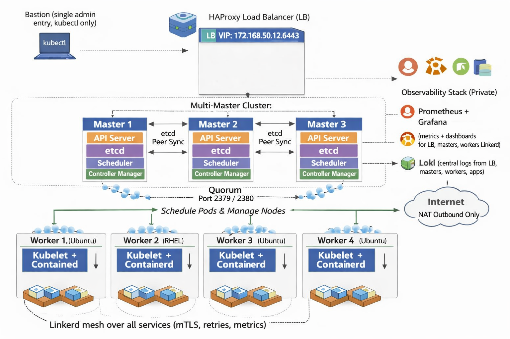

- This diagram shows your **on‑prem Kubernetes cluster** layout.  

- This diagram represents your **on‑prem Kubernetes cluster** layout.  
- All documentation in this repo is written **based on this exact architecture**.  
- Repo includes only the **important, production‑level content**:  
  - Full cluster setup (scratch → production)  
  - CNI basics + **Calico vs Flannel** comparison  
  - Calico production notes  
  - All installation steps for masters, workers, LB, bastion  
  - Firewall rules + required ports  
  - Monitoring stack (Prometheus, Grafana, Loki, Node Exporter)  
  - Logging stack (Fluent Bit → Loki)  
- Everything required to deploy, operate, and maintain this cluster is already documented.
---  

This diagram shows the high‑level architecture of your on‑prem Kubernetes cluster with Linkerd service mesh integrated.

All components, networking flows, and service‑mesh paths in the repo are based on this architecture.

